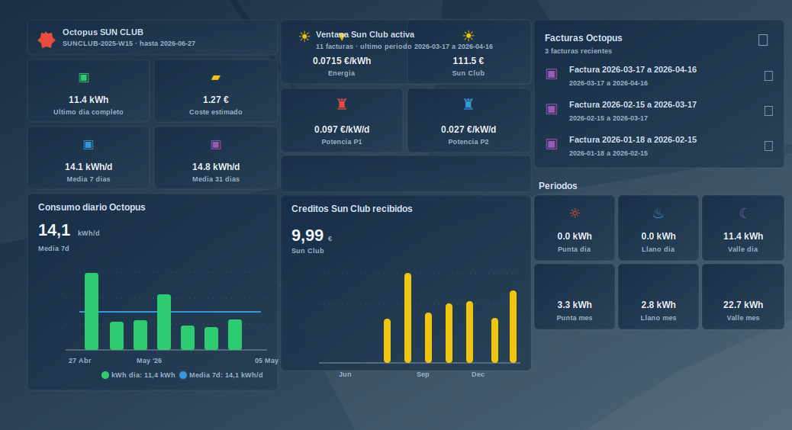

# Octopus Energy Spain para Home Assistant

Integración custom para Home Assistant que conecta con Octopus Energy Spain y expone tarifa, precios, créditos, facturas y consumo eléctrico como entidades listas para Lovelace, automatizaciones y servicios con respuesta.

> Versión actual: `0.0.10`. Octopus Energy Spain usa una API GraphQL privada de Kraken, sin contrato público ni versionado para terceros. La integración intenta ser prudente con los datos y resistente a cambios razonables, pero algún campo upstream puede cambiar sin aviso.
>
> Esta integracion no ha sido probada en todas las modalidades (Solar Wallet, Intelligent Go...) por lo que es posiblr que haga falta adaptarla para darles soporte. Se añaden diversas tool para mappear los diferentes campos de la APi de GraphQL con el fin de facilitar este trabajo.



## Qué aporta

- Tarifa activa, código de producto, fecha de validez y precios de energía/potencia.
- Precio actual de energía con la ventana Sun Club aplicada entre las 12:00 y las 18:00 en `Europe/Madrid`.
- Saldo eléctrico, créditos Sun Club y créditos referral.
- Facturas recientes con descarga PDF bajo demanda desde Home Assistant.
- Consumo diario y horario, último día completo disponible, medias de 7/31 días y consumo por periodos `Punta`, `Llano` y `Valle`.
- Coste estimado cuando Octopus no devuelve coste API, con atributos que indican que no incluye potencia, impuestos ni ajustes finales de factura.
- Series ya preparadas en atributos para dashboards con gráficas.

La integración no crea dashboards automáticamente y no modifica el panel de energía de Home Assistant. Su trabajo es exponer datos; tú decides cómo pintarlos.

## Instalación

1. Abre HACS en Home Assistant.
2. En **Integrations**, abre el menú de tres puntos y entra en **Custom repositories**.
3. Añade el repositorio:

   ```text
   https://github.com/chrislopez24/ha_octopus_spain
   ```

4. Selecciona la categoría **Integration**.
5. Instala **Octopus Energy Spain**.
6. Reinicia Home Assistant.
7. Ve a **Settings -> Devices & services -> Add integration** y busca **Octopus Energy Spain**.

La configuración se hace solo desde la UI. Home Assistant guarda email y contraseña en la entrada de configuración; los tokens temporales de Kraken se mantienen en memoria y se renuevan cuando hace falta.

## Entidades principales

Los nombres exactos pueden variar si Home Assistant aplica sufijos por tener varias cuentas configuradas, pero una instalación normal genera entidades como estas:

| Tipo | Entidades destacadas |
| --- | --- |
| Tarifa | `sensor.octopus_energy_spain_tarifa`, `sensor.octopus_energy_spain_codigo_de_tarifa`, `sensor.octopus_energy_spain_tarifa_valida_hasta` |
| Precios | `sensor.octopus_energy_spain_precio_base_energia`, `sensor.octopus_energy_spain_precio_actual_energia`, `sensor.octopus_energy_spain_precio_potencia_periodo_1`, `sensor.octopus_energy_spain_precio_potencia_periodo_2`, `sensor.octopus_energy_spain_compensacion_excedentes` |
| Sun Club y créditos | `binary_sensor.octopus_energy_spain_ventana_sun_club`, `sensor.octopus_energy_spain_creditos_sun_club`, `sensor.octopus_energy_spain_creditos_referral`, `sensor.octopus_energy_spain_saldo_credito` |
| Consumo | `sensor.octopus_energy_spain_consumo_ultimo_dia_completo_disponible`, `sensor.octopus_energy_spain_consumo_ultimos_7_dias`, `sensor.octopus_energy_spain_consumo_ultimos_31_dias` |
| Periodos | `sensor.octopus_energy_spain_consumo_ultimo_dia_punta`, `sensor.octopus_energy_spain_consumo_ultimo_dia_llano`, `sensor.octopus_energy_spain_consumo_ultimo_dia_valle`, `sensor.octopus_energy_spain_consumo_mes_actual_punta`, `sensor.octopus_energy_spain_consumo_mes_actual_llano`, `sensor.octopus_energy_spain_consumo_mes_actual_valle` |
| Costes | `sensor.octopus_energy_spain_coste_estimado_ultimo_dia_completo_disponible`, `sensor.octopus_energy_spain_coste_estimado_ultimos_7_dias`, `sensor.octopus_energy_spain_coste_estimado_mes_actual`, `sensor.octopus_energy_spain_coste_estimado_medio_diario_ultimos_7_dias` |
| Facturas y series | `sensor.octopus_energy_spain_facturas`, `sensor.octopus_energy_spain_series_de_medicion`, `sensor.octopus_energy_spain_puntos_de_medicion` |

El sensor `sensor.octopus_energy_spain_series_de_medicion` concentra atributos pensados para gráficas:

- `series.daily`, `series.weekly`, `series.monthly`, `series.yearly`
- `period_series.daily`, `period_series.monthly`
- `hourly_period_series.daily`, `hourly_period_series.monthly`
- `estimated_cost_series_by_date`

## Card de facturas

La integración incluye una card Lovelace propia para listar facturas y descargar PDFs desde Home Assistant, sin exponer URLs firmadas de Octopus en el estado.

Añade el recurso como **JavaScript module**:

```text
/octopus_spain/octopus-invoice-card.js?v=0.0.10
```

Y usa la card:

```yaml
type: custom:octopus-invoice-card
entity: sensor.octopus_energy_spain_facturas
title: Facturas Octopus
limit: 12
```

La card descarga desde `/api/octopus_spain/invoice/{invoice_id_hash}`. Ese endpoint está autenticado por Home Assistant, resuelve la URL temporal de Octopus bajo demanda, valida que la respuesta sea un PDF y lo devuelve como adjunto.

## Ejemplos Lovelace

Los ejemplos están basados en una vista real de energía con Octopus, pero están separados por tipo de card para que puedas copiar una pieza concreta en tu dashboard.

- [Tarjetas Mushroom](#tarjetas-mushroom): resumen de tarifa, consumo, precios y periodos.
- [Gráficas ApexCharts](#graficas-apexcharts): consumo diario, periodos, créditos y coste estimado.
- [Card de facturas](#card-de-facturas-en-lovelace): card incluida por esta integración.

Los bloques están pensados para pegarse directamente como una card manual en Lovelace. Aun así, tómalos como ejemplos: funcionan con los entity IDs por defecto de la integración, pero tendrás que ajustar nombres si Home Assistant ha generado sufijos, si tienes varias cuentas o si prefieres otra distribución visual.

Necesitarás instalar o registrar los recursos de las cards que uses:

- `custom:mushroom-template-card`, si usas Mushroom.
- `custom:apexcharts-card`, si quieres las gráficas.
- `custom:octopus-invoice-card`, incluida por esta integración.

### Tarjetas Mushroom

Estas cards muestran estados compactos. El patrón usa `custom:mushroom-template-card` dentro de `horizontal-stack`, porque permite comparar valores de dos o tres sensores en la misma fila.

**Tarifa activa**

```yaml
type: custom:mushroom-template-card
entity: sensor.octopus_energy_spain_tarifa
primary: "{{ states('sensor.octopus_energy_spain_tarifa') }}"
secondary: >-
  {{ states('sensor.octopus_energy_spain_codigo_de_tarifa') }} ·
  hasta {{ states('sensor.octopus_energy_spain_tarifa_valida_hasta') }}
icon: mdi:octagram
icon_color: pink
layout: horizontal
grid_options:
  columns: 12
  rows: 1
```

**Último día y coste estimado**

```yaml
type: horizontal-stack
cards:
  - type: custom:mushroom-template-card
    entity: sensor.octopus_energy_spain_consumo_ultimo_dia_completo_disponible
    primary: >-
      {{ states('sensor.octopus_energy_spain_consumo_ultimo_dia_completo_disponible')
      | float(0) | round(1) }} kWh
    secondary: Último día completo
    icon: mdi:calendar-today
    icon_color: green
    layout: vertical

  - type: custom:mushroom-template-card
    entity: sensor.octopus_energy_spain_coste_estimado_ultimo_dia_completo_disponible
    primary: >-
      {{ states('sensor.octopus_energy_spain_coste_estimado_ultimo_dia_completo_disponible')
      | float(0) | round(2) }} €
    secondary: Coste estimado
    icon: mdi:cash
    icon_color: amber
    layout: vertical
```

**Precio actual, Sun Club y potencia**

```yaml
type: grid
cards:
  - type: horizontal-stack
    cards:
      - type: custom:mushroom-template-card
        entity: sensor.octopus_energy_spain_precio_actual_energia
        primary: "{{ states('sensor.octopus_energy_spain_precio_actual_energia') }} €/kWh"
        secondary: Energía
        icon: mdi:lightning-bolt
        icon_color: yellow
        layout: vertical

      - type: custom:mushroom-template-card
        entity: sensor.octopus_energy_spain_creditos_sun_club
        primary: "{{ states('sensor.octopus_energy_spain_creditos_sun_club') | float(0) | round(2) }} €"
        secondary: Sun Club
        icon: mdi:white-balance-sunny
        icon_color: yellow
        layout: vertical

  - type: horizontal-stack
    cards:
      - type: custom:mushroom-template-card
        entity: sensor.octopus_energy_spain_precio_potencia_periodo_1
        primary: "{{ states('sensor.octopus_energy_spain_precio_potencia_periodo_1') }} €/kW/d"
        secondary: Potencia P1
        icon: mdi:transmission-tower
        icon_color: red
        layout: vertical

      - type: custom:mushroom-template-card
        entity: sensor.octopus_energy_spain_precio_potencia_periodo_2
        primary: "{{ states('sensor.octopus_energy_spain_precio_potencia_periodo_2') }} €/kW/d"
        secondary: Potencia P2
        icon: mdi:transmission-tower
        icon_color: blue
        layout: vertical
```

**Ventana Sun Club**

```yaml
type: custom:mushroom-template-card
entity: binary_sensor.octopus_energy_spain_ventana_sun_club
primary: >-
  
    Ventana Sun Club activa
  
    Sin ventana Sun Club
  
secondary: >-
  {{ states('sensor.octopus_energy_spain_facturas') }} facturas ·
  último periodo {{ state_attr('sensor.octopus_energy_spain_facturas', 'latest_period_start') }}
  a {{ state_attr('sensor.octopus_energy_spain_facturas', 'latest_period_end') }}
icon: mdi:white-balance-sunny
icon_color: >-
  
    yellow
  
    grey
  
layout: horizontal
grid_options:
  columns: 12
  rows: 1
```

**Consumo por periodos**

```yaml
type: horizontal-stack
cards:
  - type: custom:mushroom-template-card
    entity: sensor.octopus_energy_spain_consumo_mes_actual_punta
    primary: "{{ states('sensor.octopus_energy_spain_consumo_mes_actual_punta') | float(0) | round(1) }} kWh"
    secondary: Punta mes
    icon: mdi:weather-sunny-alert
    icon_color: red
    layout: vertical

  - type: custom:mushroom-template-card
    entity: sensor.octopus_energy_spain_consumo_mes_actual_llano
    primary: "{{ states('sensor.octopus_energy_spain_consumo_mes_actual_llano') | float(0) | round(1) }} kWh"
    secondary: Llano mes
    icon: mdi:weather-partly-cloudy
    icon_color: blue
    layout: vertical

  - type: custom:mushroom-template-card
    entity: sensor.octopus_energy_spain_consumo_mes_actual_valle
    primary: "{{ states('sensor.octopus_energy_spain_consumo_mes_actual_valle') | float(0) | round(1) }} kWh"
    secondary: Valle mes
    icon: mdi:weather-night
    icon_color: purple
    layout: vertical
```

<a id="graficas-apexcharts"></a>

### Gráficas ApexCharts

Las gráficas leen las series preparadas por `sensor.octopus_energy_spain_series_de_medicion`. La ventaja de este patrón es que Lovelace no necesita calcular el histórico: solo pinta atributos ya agregados por la integración.

**Consumo diario**

```yaml
type: custom:apexcharts-card
graph_span: 10d
span:
  end: day
header:
  show: true
  title: Consumo diario Octopus
  show_states: true
apex_config:
  chart:
    height: 210
    toolbar:
      show: false
  plotOptions:
    bar:
      borderRadius: 4
      columnWidth: 58%
  dataLabels:
    enabled: false
  legend:
    show: true
    position: bottom
yaxis:
  - min: 0
    decimals: 1
series:
  - entity: sensor.octopus_energy_spain_series_de_medicion
    name: kWh día
    type: column
    color: "#2ecc71"
    unit: kWh
    float_precision: 1
    show:
      in_header: false
    data_generator: |
      const rows = ((entity.attributes.series || {}).daily || []).slice(-7);
      return rows.map((row) => [
        new Date(`${row.date}T12:00:00`).getTime(),
        Number(row.kwh) || 0
      ]);
  - entity: sensor.octopus_energy_spain_consumo_medio_diario_ultimos_7_dias
    name: Media 7d
    type: line
    color: "#3498db"
    unit: kWh/d
    stroke_width: 2
    float_precision: 1
    data_generator: |
      const value = Number(entity.state) || 0;
      return [[start.getTime(), value], [end.getTime(), value]];
```

**Consumo diario por periodos**

```yaml
type: custom:apexcharts-card
graph_span: 17d
stacked: true
span:
  end: day
header:
  show: true
  title: Consumo diario por periodos
  show_states: false
apex_config:
  chart:
    height: 220
    toolbar:
      show: false
  plotOptions:
    bar:
      borderRadius: 4
      columnWidth: 62%
  dataLabels:
    enabled: false
  legend:
    show: true
    position: bottom
yaxis:
  - min: 0
    decimals: 1
series:
  - entity: sensor.octopus_energy_spain_series_de_medicion
    name: Punta
    type: column
    color: "#e74c3c"
    unit: kWh
    float_precision: 1
    data_generator: |
      const rows = ((entity.attributes.hourly_period_series || {}).daily || []).slice(-14);
      return rows.map((row) => [
        new Date(`${row.date}T12:00:00`).getTime(),
        Number(row.punta_kwh) || 0
      ]);
  - entity: sensor.octopus_energy_spain_series_de_medicion
    name: Llano
    type: column
    color: "#3498db"
    unit: kWh
    float_precision: 1
    data_generator: |
      const rows = ((entity.attributes.hourly_period_series || {}).daily || []).slice(-14);
      return rows.map((row) => [
        new Date(`${row.date}T12:00:00`).getTime(),
        Number(row.llano_kwh) || 0
      ]);
  - entity: sensor.octopus_energy_spain_series_de_medicion
    name: Valle
    type: column
    color: "#2ecc71"
    unit: kWh
    float_precision: 1
    data_generator: |
      const rows = ((entity.attributes.hourly_period_series || {}).daily || []).slice(-14);
      return rows.map((row) => [
        new Date(`${row.date}T12:00:00`).getTime(),
        Number(row.valle_kwh) || 0
      ]);
```

**Créditos Sun Club**

```yaml
type: custom:apexcharts-card
graph_span: 365d
span:
  end: day
header:
  show: true
  title: Créditos Sun Club recibidos
  show_states: true
apex_config:
  chart:
    height: 210
    toolbar:
      show: false
  plotOptions:
    bar:
      borderRadius: 4
      columnWidth: 44%
  dataLabels:
    enabled: false
  legend:
    show: false
yaxis:
  - min: 0
    decimals: 2
series:
  - entity: sensor.octopus_energy_spain_creditos_sun_club
    name: Sun Club
    type: column
    color: "#f1c40f"
    unit: €
    float_precision: 2
    data_generator: |
      const rows = (entity.attributes.recent_credits || [])
        .filter((row) => row.reason_code === "SUN_CLUB")
        .slice()
        .reverse();
      return rows.map((row) => [
        new Date(`${row.created_at}T12:00:00`).getTime(),
        Number(row.amount) || 0
      ]);
```

**Coste estimado diario**

```yaml
type: custom:apexcharts-card
graph_span: 10d
span:
  end: day
header:
  show: true
  title: Coste estimado diario
  show_states: true
yaxis:
  - min: 0
    decimals: 2
series:
  - entity: sensor.octopus_energy_spain_series_de_medicion
    name: € día
    type: column
    color: "#f1c40f"
    unit: €
    float_precision: 2
    show:
      in_header: false
    data_generator: |
      const costs = entity.attributes.estimated_cost_series_by_date || {};
      const rows = Object.keys(costs).sort().slice(-7);
      return rows.map((date) => [
        new Date(`${date}T12:00:00`).getTime(),
        Number(costs[date]) || 0
      ]);
  - entity: sensor.octopus_energy_spain_coste_estimado_medio_diario_ultimos_7_dias
    name: Media 7d
    type: line
    color: "#e67e22"
    unit: €/d
    stroke_width: 2
    float_precision: 2
    data_generator: |
      const value = Number(entity.state) || 0;
      return [[start.getTime(), value], [end.getTime(), value]];
```

### Card de facturas en Lovelace

Esta es la única card propia de la integración. El ejemplo usa `limit: 3`, pero puedes subirlo hasta 12 para mostrar más facturas recientes.

```yaml
type: custom:octopus-invoice-card
entity: sensor.octopus_energy_spain_facturas
title: Facturas Octopus
limit: 3
```

Si no usas Mushroom o ApexCharts, puedes mostrar los mismos sensores con cards nativas `tile`, `sensor`, `statistics-graph` o `entities`. La card de facturas sí requiere registrar el recurso JavaScript incluido por esta integración.

## Servicios

Servicios con respuesta disponibles:

| Servicio | Uso |
| --- | --- |
| `octopus_spain.get_invoices` | Devuelve facturas recientes redacted, sin URLs firmadas. |
| `octopus_spain.get_invoice_document` | Devuelve bajo demanda una URL temporal para una factura usando `invoice_id_hash`. |
| `octopus_spain.get_latest_invoice_document` | Devuelve bajo demanda el PDF de la factura más reciente. |
| `octopus_spain.get_invoice_document_by_index` | Devuelve una factura por posición dentro de `recent_invoices`. |
| `octopus_spain.get_measurements` | Devuelve mediciones por rango en `DAY_INTERVAL` o `HOUR_INTERVAL`. |

Ejemplo:

```yaml
service: octopus_spain.get_measurements
data:
  start_date: "2026-04-01"
  end_date: "2026-05-01"
  frequency: DAY_INTERVAL
```

## Privacidad

Este repositorio está pensado para poder publicarse sin datos personales. La integración evita exponer en estados, atributos o diagnósticos:

- CUPS, número de cuenta, número de ledger o IDs crudos de propiedad.
- Tokens, cookies, URLs firmadas, PDFs o credenciales.
- IDs crudos de factura.

Las referencias visibles usan hashes cortos estables. Las URLs firmadas de facturas solo se resuelven cuando llamas a un servicio o descargas desde la card.

## Limitaciones conocidas

- La API de Octopus Spain es privada y puede cambiar.
- La selección de cuenta es automática y usa la primera cuenta eléctrica usable.
- Los sensores de última factura pueden quedar `unknown` si Kraken no devuelve `statementsWithDetails`.
- El coste estimado es informativo: no incluye potencia, impuestos, alquiler de contador, descuentos extraordinarios ni ajustes finales de factura.
- El panel de energía de Home Assistant requiere estadísticas de largo plazo; esta integración no importa estadísticas ni toca esa configuración.

## Desarrollo

Comandos habituales:

```bash
python3 -m compileall custom_components tools
python3 -m pytest -q
```

Las herramientas de `tools/` son probes manuales contra la API privada. Requieren `.env` local y sus salidas no deben publicarse con datos de cuenta.

Documentación técnica:

- [docs/octopus-spain-graphql-api.md](docs/octopus-spain-graphql-api.md)
